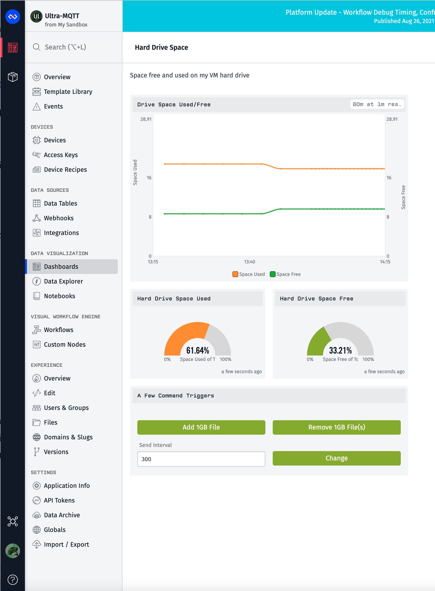
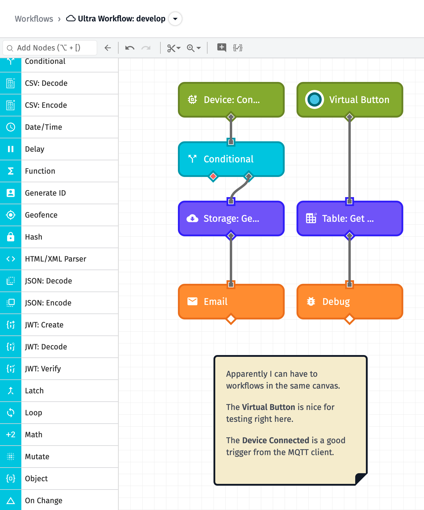
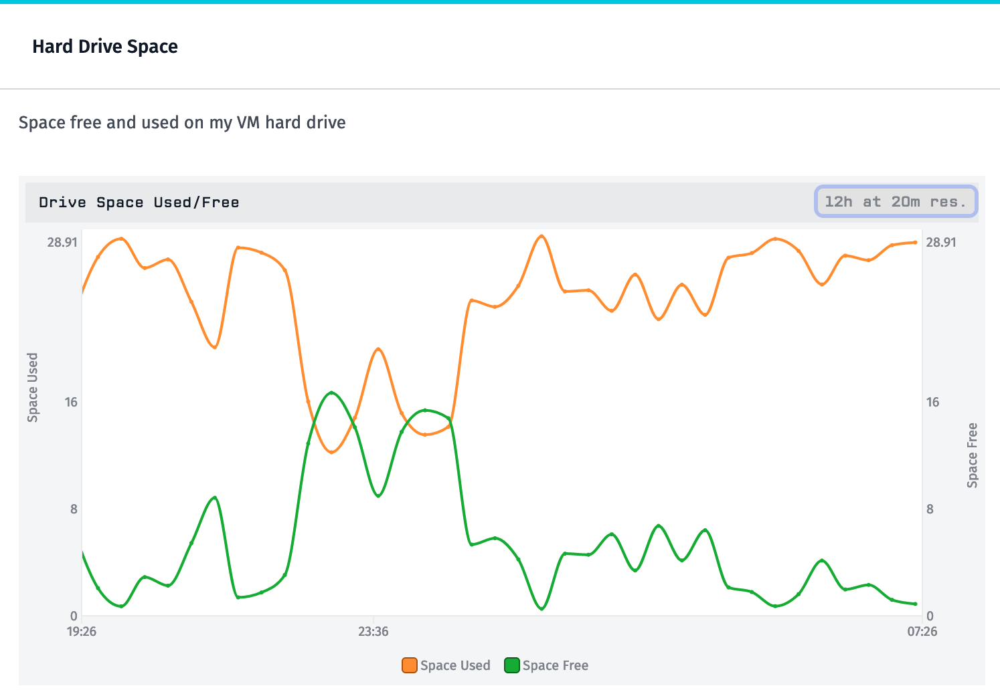

ultra-mqtt

# Introduction

A test project w/ Python MQTT client connecting to Losant broker.

A typical use case of an MQTT client is a sensor that sends 
temperature or humidity data to the broker. In this case, I send
hard drive "free space" and "used space" as attributes to Losant. 

Communication can be a two-way street, so I added push-buttons on 
the Losant dashboard to generate and remove a 1GB file on the 
client machine.

The basis of this code came from the 
[Losant Python MQTT Client](https://docs.losant.com/mqtt/python/) page. 
I fleshed it out a bit, added a secondary timer, and accepted 
push-button commands from the Losant dashboard.

# Coding Details

The RepeatTimer is used such that I can send data when I want to 
send it despite the event loop running every second to keep the
connection alive.

The "commands" (for on_command) were put into a single module under 
a switcher.

I've included a shel (.sh) script for redirecting network traffic
from broker.losant.com to my own VM. From this I was able to trap and 
test the connection without unplugging cables.

Finally, I put the data-generating callback functions in a separate
module called simulators.py. Originally this project was to send
hard drive free/used space to the Losant MQTT Broker. I expanded on
this idea to create a "random simulator" that is already better than
the one offered on the Losant site because I can send floating point
numbers.

# The Dashboard

## The layout

Regarding the dashboard layout below, note the push-buttons towards 
the bottom, which were wired-up and do work.

The blip in the graph occurred when I removed the 1GB file that
was lying around.

# Workflows

Losant provides "workflows," which allow you to do specific actions
based upon triggers from the data. For example, if a device connects,
I have an Email sent to me. (See figure below, left column) You will
note the Conditional node that only has a "yes" connection. This was
so that I could turn off the emails while I was testing the client
python code.

The second column shows a Virtual Button, which lets me do some
testing right from the workflow canvas instead of from the MQTT
client itself. In this case, I simply use the Debug node, which 
shows me the resultant payload through the workflow.

Note that I can have two wholly separate workflows on the same canvas.
Not sure that's worth anything, but it is possible.

# The Losant Broker

Losant acts as an MQTT broker to an MQTT client, which is what this
repo provides. This section describes various features on the Losant
side relative to this communication.

## On the Dashboard

The "Pause" button on the Losant dashboard seems to only pause
the dashboard. It doesn't sever the connection with the MQTT client.

## Under Devices

Under Devices there are some "Device Actions." Although you can force
a connection status of Connected or Disconnected, neither of these
affect a connected MQTT Client. I'm not sure what value these have
then.

## Deleting cruft data

While you can clear the Device Log, you cannot clear the Connection
Log nor the Recent Device States log directly. However, there is a 
pull-down option in the Device Actions button called "Delete Data," 
but note that it won't work if you have a connected MQTT Client. 
And Losant doesn't give you a warning or nuthin'. Hmmm.

Using the "Delete Data" option, when successful, deletes not only
the connection log but the saved state data. That's nice for "resetting"
the graph on the dashboard.

# Simulators

Simulators are simply the data generating callback functions. These
generate data and send to Losant. The initial one was send_space_usage(),
which sends amount of spaced used on my hard drive. Of course, these
values don't change often or by much on a GB scale.

I soon realized that I could create *other* data generation functions
and swap them out. Ah ha! Now this tool is becoming useful, which is 
what any self-respecting Piglet wants to be. Thus, run.sh now allows 
a second argument to name the simulator to invoke at run-time.

The first alternate simulator was send_random(). While this works,
and is similar to the Device Simulator on the Losant website, it 
doesn't seem real-world. Maybe there is a stress-testing scenario
that might benefit from this, but I am scratching my head on this.

The send_random_walk() simulator was next, which better represents
actual real-world data. At the time of this writing, I noticed that
the overnight values seem to cling toward the upper bound. I'm 
switching over to secrets.SystemRandom for random number generation, 
which may improve the results.

The below picture is the overnight output of the random walk sending
data every 120s. This was before I switched to secrets.SystemRandom. 
It's not bad . . . it does show a *possible* real-world scenario. I 
just don't know if this is a *probable* real-world scenario.

